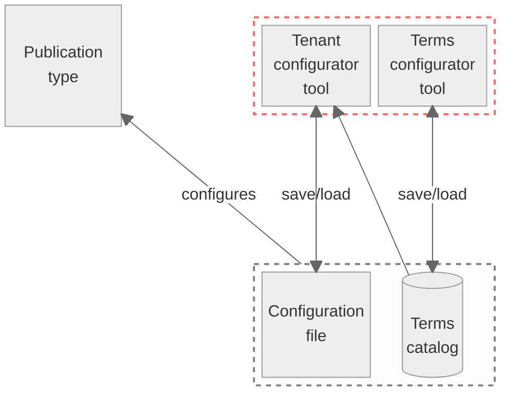

# Publication Configurator
> [!TIP]
> To get a better understanding of the interaction between the individual artifacts, it is recommended to read ["Big Picture"](https://github.com/officialgazette/big-picture) first.

The publication configurator is used for simple type configuration using a graphical user interface. A configuration file of a tenant can be imported and edited in the tool.

${\color{red}----}$ Scope of this repository

${\color{grey}----}$ Out of scope (for the Publication Configuration Server see Repository [here](https://github.com/officialgazette/publication-configurator-server))

## Tenant configuration tool
The configuration tool can create/edit a JSON file that configures the publication types. This JSON file must be loaded into the publication types server.

The screenshot above shows the config screen of the tool. The left-hand side lists the general terms catalog, while the right-hand side shows the tenant-specific configuration.
## Terms configuration tool
The terms configuration tool can create/edit a JSON file (referred as "Terms Database") which defines the standard terms and their assignment to a standard publication type.

The created/edited JSON file must then be loaded into the publication types server, see Repository [here](https://github.com/officialgazette/publication-configurator-server)). Note: For security reasons, there is no connection between the publication type configurator tools and the publication type server. The created/edited JSON files are added manually to the productive server environment. The JSON files are stored in the browser cache only.

>[!TIP]
> To try out the configuration tools, we recommend using the sample JSON files from the standards repository and load them into the online publication type configurator at the following URLs:
> * Tenant configurator tool: https://amtsblattportal.ch/terms/ui
> * Terms configurator tool: https://amtsblattportal.ch/terms/ui/root
