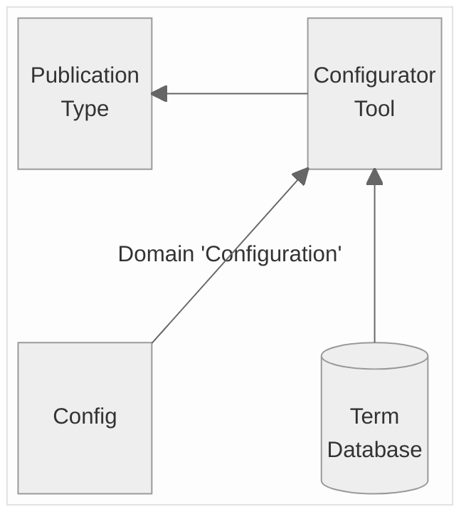

# Publication Type Configurator

The publication type configurator is used for simple type configuration using a graphical user interface. A configuration file of a publisher (tenant) can be imported and edited in the tool.

The configuration tool can create/edit a JSON file that configures the publication types. This JSON file must be loaded into the publication types server.
